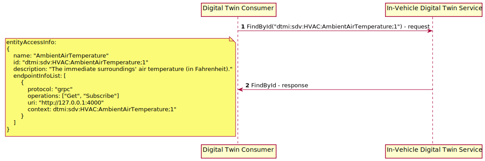
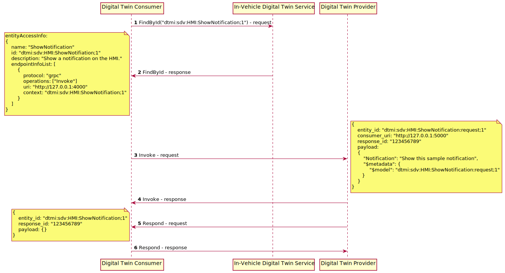

# Design Specification for Ibeji

- [Introduction](#introduction)
- [Architecture](#architecture)
- [DTDL](#dtdl)
- [In-Vehicle Digital Twin Service](#in-vehicle-digital-twin-service)
- [Provider](#provider)
- [Consumer](#consumer)

## <a name="introduction">Introduction</a>

This project delivers an In-Vehicle software component that is a digital representation of vehicle hardware resources. The representation is usable by other software in the vehicle to read/write/query vehicle hardware resources in a standardized manner.

Please note that the initial Ibeji implementation is a proof-of-concept. We would like to see it evolve into an enterprise class solution.

## <a name="architecture">Architecture</a>

Ibeji has three main architectural concepts:

- Consumer
- Provider
- In-Vehicle Digital Twin Service

The first Ibeji architectural concept that we will introduce is the Consumer. A Consumer is a software entity that utilizes Ibeji to interface with the digital representation of the In-Vehicle hardware components.

Another Ibeji architectural concept is the Provider. A Provider is the access point to some/all of the vehicle's hardware resources. A Provider registers itself with the In-Vehicle Digital Twin Service. Once registered, the In-Vehicle Digital Twin Service can make the resources available to Consumers. Each resource includes meta data that allow Consumers to understand the semantics of the resource and know how to interact with it. The In-Vehicle Digital Twin Service supports multiple simultaneous Providers and internally resolves overlapping resources offered by multiple Providers. These overlaps offer multiple options for interacting with a resource and can improve the resource's availability (by supporting multiple access paths). A Provider must support a Provider interface that enables access to resource data feeds.

In the middle is the In-Vehicle Digital Twin Service. It exports a query interface that enables Consumers to discover the vehicle's resources and provides the details necessary to use those resources. The In-Vehicle Digital Twin Service has an interface that allows Providers to dynamically register and unregister resources.

Below is the component diagram for Ibeji.


## <a name="dtdl">DTDL</a>

Fundamental to the Ibeji solution is its use of Digital Twin Definition Language [DTDL](https://github.com/Azure/opendigitaltwins-dtdl) to identify and specify each of the vehicle's resources, and to provide the metadata needed to interact the resource.

This initial contribution does not try to arrange the resources into a hierarchy or into a graph. It is intended that some future update will enable this capability.

DTDL can identify and specify each of the resources. DTDL allows additional metadata to be associated with each of the resources, specifically the endpoint that can be used to interact with that resource. Below is an example for the AmbientAirTemperature property. You can see that the resource has the "RemotelyAccessible" type, which allows it to specify remote access metadata. The remote_access element utilizes an "Endpoint" type to specify the resource's endpoint and the supported operations.

```uml
  {
    "@context": ["dtmi:dtdl:context;2", "dtmi:sdv:context;3"],
    "@type": "Interface",
    "@id": "dtmi:org:eclipse:sdv:interface:cabin:AmbientAirTemperature;1",
    "contents": [
      {
        "@type": ["Property", "Temperature", "RemotelyAccessible"],
        "@id": "dtmi:org:eclipse:sdv:property:cabin:AmbientAirTemperature;1",
        "name": "Cabin_AmbientAirTemperature",
        "description": "The immediate surroundings air temperature (in Fahrenheit).",
        "schema": "double",
        "unit": "degreeFahrenheit",
        "remote_access": [
          {
            "@type": "Endpoint",
            "uri": "http://[::1]:40010",
            "operations": [ "Get", "Set", "Subscribe", "Unsubscribe" ]
          }
        ]
      }
    ]
  }
```

The DTDL must use the standard dtmi dtdl context. It must also use the dtmi sdv context, which provides the definitions for the RemotelyAccessible type and the remote_access element.

## <a name="in-vehicle-digital-twin-service">In-Vehicle Digital Twin Service</a>

### In-Vehicle Digital Twin Service Overview

The initial In-Vehicle Digital Twin Service will provide the functionality needed by the proof-of-concept. On the Provider side, this initial contribution supports only a single Provider registering its DTDL. On the Consumer side, there is a simplified query api, and the ability to subscribe to a provided hardware resource data feed and to invoke commands on provided hardware resources.

### Interfaces

The initial In-Vehicle Digital Twin Service supports both Providers and Consumers with a gRPC interface.

### Activities

#### Register

Below is the sequence diagram for the Register activity.


#### Find by Id

Below is the sequence diagram for the Find-By-Id activity.



## <a name="provider">Provider</a>

### Overview

The initial Providers will implement basic resources - the AmbientAirTemperature property and the send_notification command.

### Interfaces

A Provider supports a gRPC interface for subscribing to resource's data feeds, unsubscribing from a resource's data feed, requesting a resource's value, setting a resource's value and invoking a command.

### Activities

#### Subscribe

Below is the sequence diagram for the Subscribe activity. The Provider's endpoint details are exported by the Provider as DTDL to the Digital Twin Service.


#### Invoke

Below is the sequence diagram for the Invoke activity. The Provider's endpoint details are exported by the Provider as DTDL to the Digital Twin Service.



## <a name="consumer">Consumer</a>

### Overview

The initial Consumers will provide the functionality needed by the proof-of-concept to subscribe to resources data feeds and invoke commands on resources.

Interfaces

A Consumer supports a gRPC interface that is the callback/notification endpoint for subscribed-to data feeds.

Activities

#### Publish

Below is the sequence diagram for the Publish activity.


#### Respond

Below is the sequence diagram for the Respond activity.


## <a name="appendix-a">Appendix A – Provider gRPC Interface</a>

### Subscribe

Subscribe to an property's data feed.

#### Request

- entity_id - The property's id.
- consumer_uri - The uri for the consumer endpoint where the data feed will be delivered.

#### Response

- No response.

### Unsubscribe

Unsubscribe from an entity's data feed.

#### Request

- entity_id - The property's id.
- consumer_uri - The uri for the consumer endpoint where the data feed should no longer be delivered.

#### Response

- No response.

### Get

Get the latest value for a property and publish it to a consumer endpoint.

#### Request

- entity_id - The property's id.
- consumer_uri -  The uri for the consumer endpoint where the value should be delivered.

#### Response

- No response.

### Set

Set an entity's value to the one provided. This may not cause a change if the entity cannot be updated.

#### Request

- entity_id - The entity's id.
- value - The entity's new value.

#### Response

- No response.

### Invoke

Invoke a command.

#### Request

- entity_id - The command's id.
- uri - The uri for the endpoint where the command's response should be delivered.
- payload - The command's request payload.

#### Response

- No response.

## <a name="appendix-b">Appendix B – Digital Twin gRPC Interface</a>

### FindById

Find an entity's DTDL.

#### Request

- entity_id - The entity's id.

#### Response

- dtdl - The resource's DTDL.

### Register

Register one or more entities.

#### Request

- dtdl - The DTDL that represents the entities.

#### Response

- No response.

### Unregister

Unregister a entity.

#### Request

- id - The resource's id.

#### Response

- No response.

## <a name="appendix-c">Appendix C – Consumer gRPC Interface</a>

### Publish

Publish a value for a specific entity.

#### Request

- entity_id - The entity's id.
- value - The value to publish.

#### Response

- No response.

### Respond

Respond for the execution of a command.

#### Request

- entity_id - The command's id.
- response_id - The id that the invoker of the command provided for the response.
- payload - The command's response payload.

#### Response

- No response.
