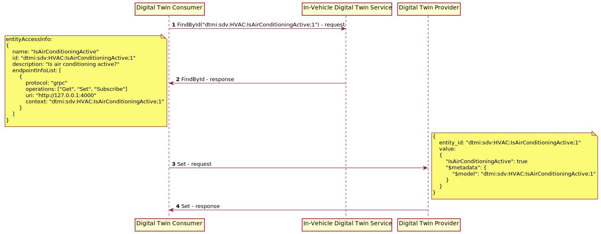

# Design Specification for Project Eclipse Ibeji

- [Introduction](#introduction)
- [Architecture](#architecture)
- [DTDL](#dtdl)
- [In-Vehicle Digital Twin Service](#in-vehicle-digital-twin-service)
- [Sample Digital Twin Interactions](#sample-digital-twin-interactions)
- [Appendix: Digital Twin Interface](#appendix-digital-twin-interface)

## <a name="introduction">Introduction</a>

Project Eclipse Ibeji delivers an In-Vehicle software component that provides a digital representation of vehicle hardware resources. The representation is usable by other software in the vehicle to monitor and control vehicle hardware resources in a standardized manner.

Please note that the initial Ibeji implementation is a proof-of-concept. We would like to see it evolve into an enterprise class solution.

## <a name="architecture">Architecture</a>

Ibeji has three main architectural concepts:

- Digital Twin Consumer
- Digital Twin Provider
- In-Vehicle Digital Twin Service

The first Ibeji architectural concept that we will introduce is the Digital Twin Consumer. A Digital Twin Consumer is a software entity that utilizes Ibeji to interface with the digital representation of the In-Vehicle hardware components.

Another Ibeji architectural concept is the Digital Twin Provider. A Digital Twin Provider is the access point to some/all of the vehicle's hardware resources. A Digital Twin Provider registers itself with the In-Vehicle Digital Twin Service. Once registered, the In-Vehicle Digital Twin Service can make the resources available to Digital Twin Consumers. Each resource includes metadata so that Digital Twin Consumers know how to interact with it. The In-Vehicle Digital Twin Service supports multiple simultaneous Digital Twin Providers and accommodates overlapping resources offered by multiple Digital Twin Providers. These overlaps offer multiple options for interacting with a resource and can improve the resource's availability (by supporting multiple access paths).

The final architectural concept is the In-Vehicle Digital Twin Service. It has an interface that enables Digital Twin Consumers to discover the vehicle's resources and provides the details necessary to interact with those resources. The In-Vehicle Digital Twin Service has an interface that allows Digital Twin Providers to dynamically register their resources.

Below is the architectural diagram for Ibeji.


## <a name="dtdl">DTDL</a>

Fundamental to the Ibeji solution is its use of Digital Twin Definition Language [DTDL](https://github.com/Azure/opendigitaltwins-dtdl) to identify and specify each of the vehicle's resources.  We are using Version 3 of DTDL.

This initial contribution does not try to arrange the resources into a hierarchy or into a graph. It is expected that some future version will facilitate this.

DTDL can identify and specify each of the resources. Below is an example of a HVAC resource.

```json
{
  "@context": ["dtmi:dtdl:context;3"],
  "@type": "Interface",
  "@id": "dtmi:sdv:HVAC;1",
  "description": "Heat, Ventilation and Air Conditioning",
  "contents": [
    {
        "@type": "Property",
        "@id": "dtmi:sdv:HVAC:AmbientAirTemperature;1",
        "name": "AmbientAirTemperature",
        "description": "The immediate surroundings air temperature (in Fahrenheit).",
        "schema": "integer"
      },
      {
        "@type": "Property",
        "@id": "dtmi:sdv:HVAC:IsAirConditioningActive;1",
        "name": "IsAirConditioningActive",
        "description": "Is air conditioning active?",
        "schema": "boolean"
      }
  ]
}
```

## <a name="in-vehicle-digital-twin-service">In-Vehicle Digital Twin Service</a>

### Activities

#### Register

Below is the sequence diagram for the Register activity.


#### Find by Id

Below is the sequence diagram for the Find-By-Id activity.


## <a name="sample-digital-twin-interactions">Sample Digital Twin Interactions</a>

### Activities

#### Get

The sequence diagram for a Digital Twin Consumer using the Get operation.


#### Set

The sequence diagram for a Digital Twin Consumer using the Set operation.



#### Subscribe

The sequence diagram for a Digital Twin Consumer using the Subscribe operation.


#### Invoke

The sequence diagram for a Digital Twin Consumer using the Invoke operation.


## <a name="appendix-digital-twin-interface">Appendix: Digital Twin Interface</a>

### FindById

Find an entity's access information.

#### Request

- entity_id - The entity's id.

#### Response

- entity_access_info - The entity's access information.

### Register

Register one or more entities access information.

#### Request

- entity_access_info_list - A list of entity access information.

#### Response

- No response.
