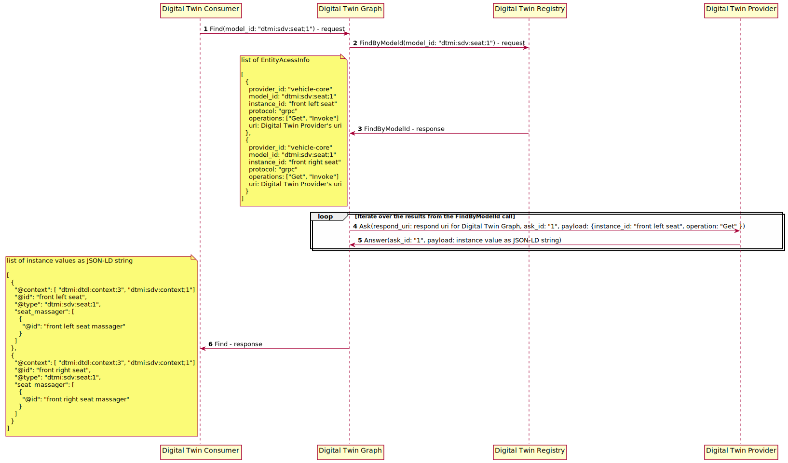

# Design Specification for Digital Twin Graph Service

- [Introduction](#introduction)
- [Architecture](#architecture)
- [Sequences](#sequences)

## <a name="introduction">Introduction</a>

Ibeji today provides the foundations for constructing and interacting with a digital twin on an edge device. These are low-level abilities and do not necessarily
provide a consumer with the best interaction experience. They can be used as building blocks to build facades that provide a consumer with an abstraction that
delivers a better interaction experience. In the future, Ibeji may support multiple facades and the user can select the one that they prefer to use.

This design specifies a graph-based facade, which will be named the Digital Twin Graph service. The digital twin will be represented as a graph of digital twin
entities whose arcs represent the relationships between those entities.

Please note that Ibeji is intended for use on an edge device to satisfy IoT needs. It is not intended for use in the cloud. The data that it manages can be
transferred to the cloud, through components like Freyja.

## <a name="architecture">Architecture</a>

Ibeji's Application Server, which we will refer to as "Digital Twin App Server", has a modular architecture that allows new services to readily be added and existing
services to readily be removed. It also has build-time feature switches for controlling which service should be available at run-time. Ibeji's initial service, the
Invehicle Digital Twin service, was developed before the adoption of the modular architecture, but it will eventually be migrated across to it.

We will introduce a new service named "Digital Twin Graph" that will provide a facade for the Invehicle Digital Twin service and the providers. Ideally, the consumer
will not need to directly interact with provider endpoints. Instead, they will interact with a graph structure that represents the digital twin,

Ibeji's existing Invehicle Digital Twin service needs some adjustments to support the Digital Twin Graph service. There is a future plan plan to rename it as the
Digital Twin Registry service. We will introduce a modified form of the service under the name "Digital Twin Registry" and for now keep the existing functionality
intact under the original name "Invehicle Digital Twin".

The Managed Subscriber service is an optional service that provides integration with Agemo. It has been included in the component diagram for completeness sake.

## <a name="sequences">Sequences</a>

### Find

The Digital Twin Graph's find operation allows you to retrieve all instance values that have a specific model id.

### Get

The Digital Twin's get operation allows you to retrieve an instance value. You can reduce the scope of the result by specifying a specific member path within the instance.

### Set

The Digital Twin's set operation allows you to modify an instance value. You can reduce the scope of the change by specifying a specific member path within the instance.

Note: This operation will not be implemented during the first phase of the Digital Twin Graph.  However, it will implemented soon after.

### Invoke

The Digital Twin's invoke operation allows you to call an instance's command. You can use the member path to specify which of the instance's command is to be performed.

