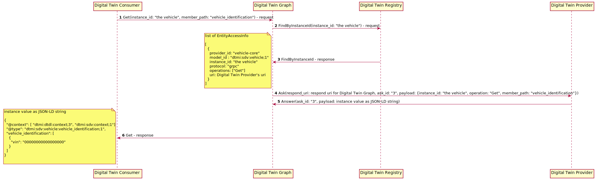
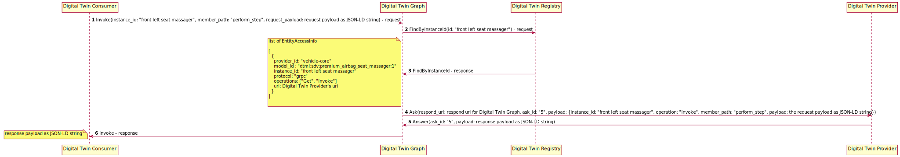

# Design Specification for Digital Twin Graph Service

- [Introduction](#introduction)
- [Architecture](#architecture)
- [Operations](#operations)

## <a name="introduction">Introduction</a>

Ibeji today provides the foundations for constructing and interacting with a digital twin on an edge device. These are low-level abilities and do not necessarily
provide a consumer with the best interaction experience. They can be used as building blocks to build facades that provide a consumer with an abstraction that
delivers a much better interaction experience. In the future, Ibeji may support multiple facades and the user can select the one that they prefer to use.

This design specifies a graph-based facade, which will be named the Digital Twin Graph Service. With this facade, the digital twin will be represented as a
graph of digital twin entities whose arcs represent the relationships between those entities.  Instance IDs will be used to refer to entities.

Please note that Ibeji is only intended for use on an IoT edge device. It is not intended for use in the cloud. The data that it manages can be
transferred to the cloud, through components like [Eclipse Freyja](https://github.com/eclipse-ibeji/freyja).

## <a name="architecture">Architecture</a>

Ibeji's Application Server, which we will refer to as "Digital Twin App Server", has a modular architecture that allows services to readily be added and removed.
It also has build-time feature switches for controlling which service should be available at run-time. Ibeji's initial service, the In-vehicle Digital Twin
service, was developed before the adoption of the modular architecture, so it cannot be readily removed.

We will introduce a new service named "Digital Twin Graph" that will provide a facade for interactions with the In-vehicle Digital Twin Service and the
providers. Ideally, the consumer will not need to directly interact with provider endpoints. Instead, the consumer will interact with a graph structure that
represents the digital twin.

Ibeji's In-vehicle Digital Twin Service needs some adjustments to support the Digital Twin Graph Service. We will introduce a modified form of the service under the name "Digital Twin Registry" and keep the existing functionality intact under the original In-vehicle Digital Twin Service.

The Managed Subscriber Service is an optional service that provides integration with Agemo. The Managed Subscriber Service has been included in the component diagram for completeness' sake.

## <a name="operations">Operations</a>

The Digital Twin Graph Service will support four operations:

- Find
- Get
- Invoke
- Set (this operation will be implemented in a later phase)

### Find

The Digital Twin Graph's find operation allows you to retrieve all instance values that have a specific model id.

### Get

The Digital Twin's get operation allows you to retrieve an instance value. You can reduce the scope of the result by specifying a specific member path within the instance.

### Set

The Digital Twin's set operation allows you to modify an instance value. You can reduce the scope of the change by specifying a specific member path within the instance.

### Invoke

The Digital Twin's invoke operation allows you to call an instance's command. You can use the member path to specify which of the instance's command is to be performed.

