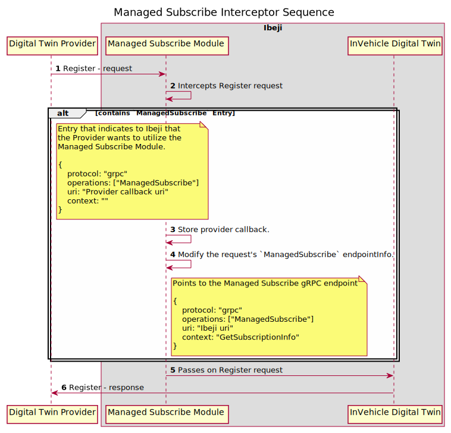
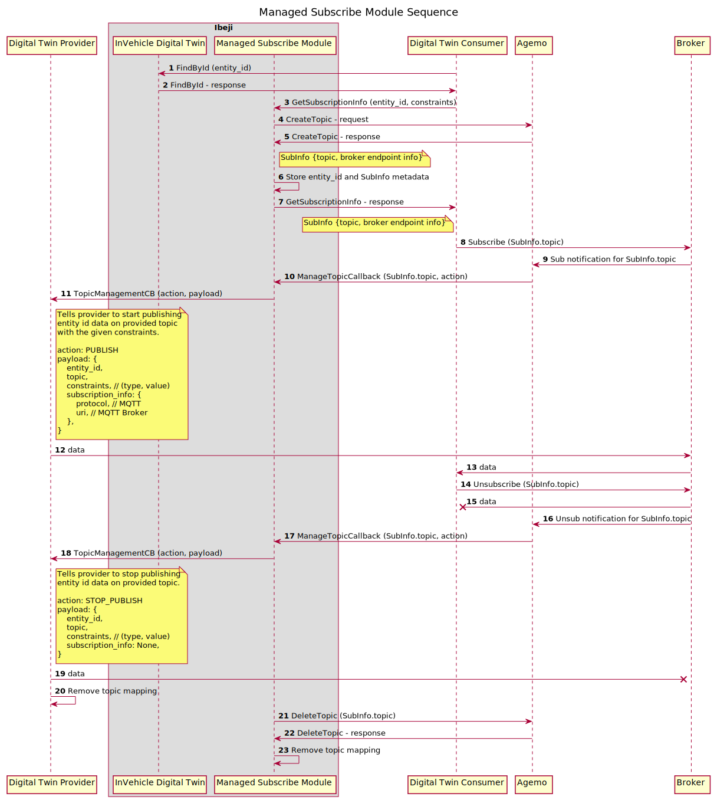
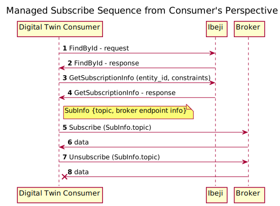
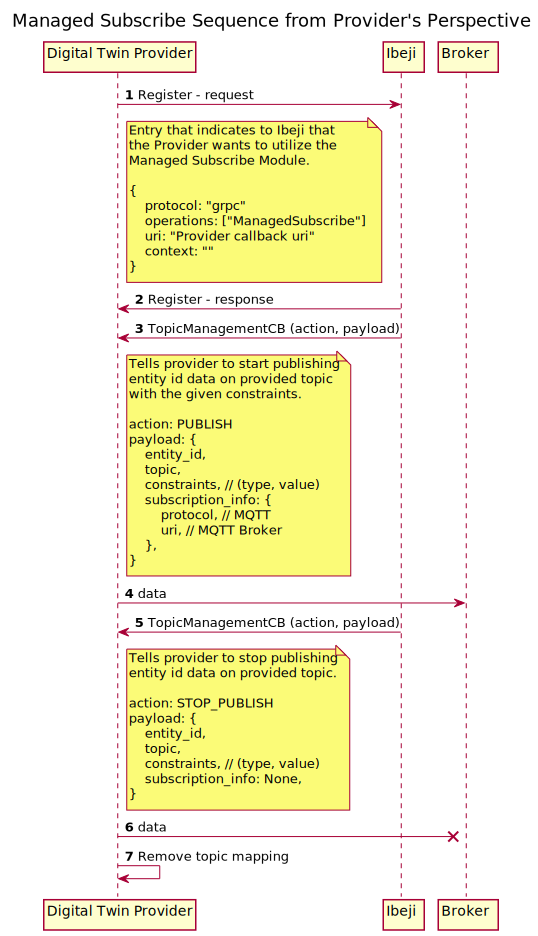

## Managed Subscribe Sample

### Introduction

The managed subscribe sample shows how Ibeji can extend its functionality with modules to give
providers and consumers more capabilities. This sample utilizes the 'Managed Subscribe' module to
allow a consumer to get an MQTT subscription for the AmbientAirTemperature value of a vehicle at a
specific frequency in milliseconds. The provider, through the module, will publish the temperature
value at the requested frequency for each consumer on its own topic and once the consumer
disconnects it will stop publishing to that dynamically generated topic.

### Setup

1. Create the four config files with the following contents, if they are not already there:

    ---- consumer_settings.yaml ----

    ```yaml
    invehicle_digital_twin_uri: "http://0.0.0.0:5010"
    ```

    ---- invehicle_digital_twin_settings.yaml ----

    ```yaml
    invehicle_digital_twin_authority: "0.0.0.0:5010"
    ```

    ---- managed_subscribe_settings.yaml ----

    ```yaml
    base_authority: "0.0.0.0:5010"
    managed_subscribe_uri_source:
      Local:
        service_uri: "http://0.0.0.0:50051"
    ```

    ---- provider_settings.yaml ----

    ```yaml
    provider_authority: "0.0.0.0:4010"
    invehicle_digital_twin_uri: "http://0.0.0.0:5010"
    ```

1. Build the project with the `managed_subscribe` feature enabled.

    ```shell
    cargo build --features managed_subscribe
    ```

### Running the Sample

#### Steps

This sample uses [Agemo](https://github.com/eclipse-chariott/Agemo); please make sure that it is
running.

1. The best way to run the demo is by using three windows: one running the In-Vehicle Digital Twin,
one running the Digital Twin Provider and one running the Digital Twin Consumer.
Orientate the three windows so that they are lined up in a column. The top window can be used for
the In-Vehicle Digital Twin.
The middle window can be used for the Digital Twin Provider. The bottom window can be used for the
Digital Twin Consumer.<br>
1. In each window, change directory to the directory containing the build artifacts.
Make sure that you replace "{repo-root-dir}" with the repository root directory on the machine
where you are running the demo.<br><br>
`cd {repo-root-dir}/target/debug`

1. In the top window, run:<br><br>
`./invehicle-digital-twin`

1. In the middle window, run:<br><br>
`./property-provider`

1. In the bottom window, run:<br><br>
`./property-consumer freq_ms=<value>`
    > Note: The consumer currently has a minimum frequency rate of 1000 ms, so set accordingly.
    Default is 10000 ms (10 secs) if no value is set in the optional `freq_ms` flag.<br>
    > Note: One or more consumers can be run with different frequencies. This will show how a
    provider can serve the same value in different ways dynamically. If one consumer is stopped,
    the other consumers will still receive the data.

1. To shutdown, use control-c on the consumer first. This will show the topic thread being shutdown
in the provider. Then control-c the other windows when you wish to stop the demo.

#### Running with Chariott

If you want to use Chariott with this sample:

1. Update the following settings:

    ---- invehicle_digital_twin_settings.yaml ----

    ```yaml
    invehicle_digital_twin_authority: "0.0.0.0:5010"
    chariott_uri: "http://0.0.0.0:50000"
    ```

    ---- managed_subscribe_settings.yaml ----

    ```yaml
    base_authority: "0.0.0.0:5010"
    managed_subscribe_uri_source:
      Chariott:
        chariott_uri: "http://0.0.0.0:50000"
        service_identifier:
          namespace: "sdv.pubsub"
          name: "dynamic.pubsub"
          version: "0.1.0"
    ```

1. Ensure Chariott is [running](../../README.md#using-chariott).

1. Start Agemo with [Chariott enabled](https://github.com/eclipse-chariott/Agemo/tree/main/pub-sub-service#running-with-chariott).

1. Follow the [Running the Sample Steps](#steps) as normal.

### Managed Subscribe Module

The managed subscribe module utilizes the [Agemo](https://github.com/eclipse-chariott/Agemo)
service to provide dynamic topic creation and subscription management. The module checks a
provider's registration request to see if the provider is requesting the use of the module. If so,
the module will inject the module's gRPC service endpoint for consumers to communicate with to
request a subscription for an entity id with specific constraints. In this example, the constraint
is frequency. Once a consumer has requested a subscription, the module will create a dynamic topic
through Agemo and tell the relevant provider to start publishing to that topic with the specific
constraints.

#### Register Interceptor Sequence

This diagram shows the portion of the module that handles the modification of a provider's
registration data. As seen in the diagram, both `Managed Subscribe Module` and
`InVehicle Digital Twin` are under the same overall service of `Ibeji`. From the provider's
perspective, it is registering with Ibeji and the other steps are internal to Ibeji.



#### Managed Subscribe Module Sequence

This diagram shows the portion of the module that handles the managed topic creation and management
through Agemo for the providers. Similar to the above diagram, both `Managed Subscribe Module` and
`InVehicle Digital Twin` are both internal to `Ibeji`. Neither the provider or the consumer
directly communicate with Agemo. Simplified views of the consumer's interaction and provider's
interaction can be seen in the diagrams under
[From the Consumer's Perspective](#from-the-consumers-perspective) and
[From the Provider's Perspective](#from-the-providers-perspective).



#### From the Consumer's Perspective

The above diagrams show the full sequence of events that happen and how the module interacts with
the requests to deliver dynamic topics on demand. Below is a diagram that shows only what is
expected of a consumer. Through this diagram we can see that only one additional call is added
compared to a Subscribe request that does not need to be customized.



#### From the Provider's Perspective

Similar to the consumer diagram, this shows what is expected of a provider that wants to leverage
the managed subscribe module. We can see that the provider needs to signal to Ibeji when
registering that it would like to leverage the managed subscribe module if it is available. This
also means that the provider has implemented the `TopicManagementCB` endpoint so that the module
can communicate with it. The provider then acts when directed to from a `TopicManagementCB` call,
offloading some of the topic management to the module.


